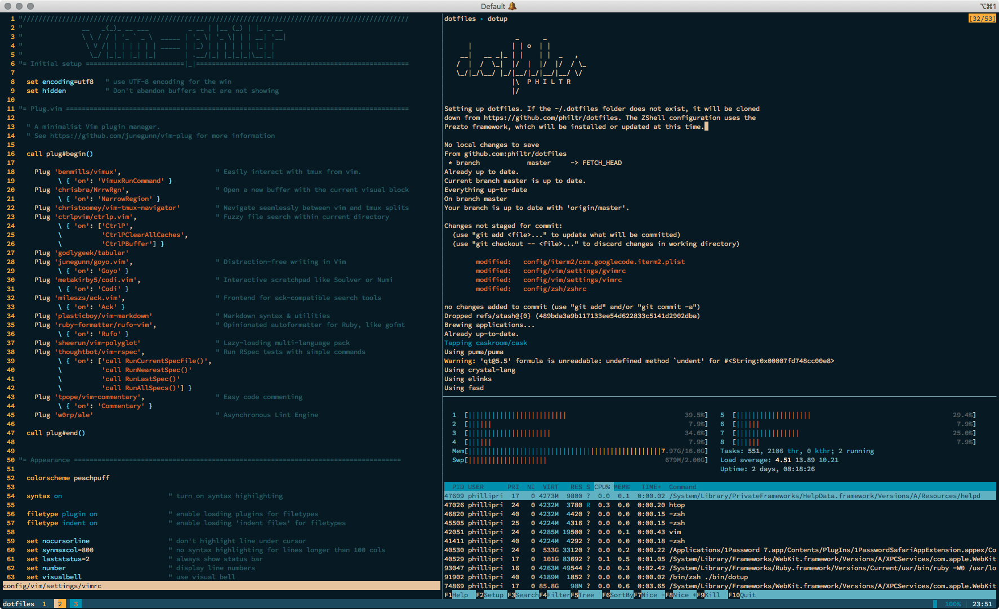

# Dotfiles

```
                  _      _
      |          | | o  | |
    __|   __ _|_ | |    | |  _   ,
   /  |  /  \_|  |/  |  |/  |/  / \_
   \_/|_/\__/ |_/|__/|_/|__/|__/ \/
                 |\  P H I L T R
                 |/
```

## Preview



## Installation:

```sh
curl https://raw.githubusercontent.com/philtr/dotfiles/master/install.sh | /bin/zsh
```

## Post-installation:

Follow on-screen instructions for changing your login shell to `/bin/zsh` and setting up iTerm2 settings.

* Set ZShell as your login shell
  - run \`chsh\`
  - enter your password
  - type '/bin/zsh' at the prompt

* Set iTerm configuration to load config
  - Open iTerm preferences
  - Check "Load preferences from a user-defined folder or URL"
  - Put in `$HOMEDIR/.dotfiles/iterm2`

